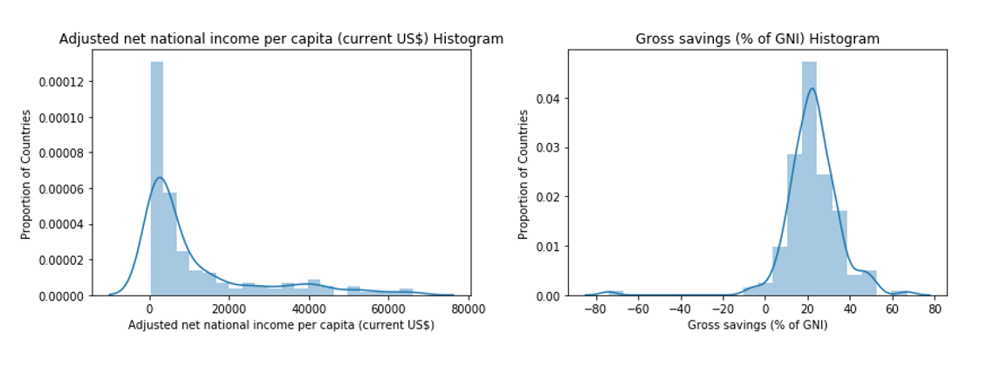

# World Indicators Anomaly Detection
## Introduction
I set out to build an anomaly detection model that could identify outlier countries based on their economic indicator features.  This would help easily identify countries experiencing or susceptible to some sort of economic shock, an unpredictable event like a war or pandemic that has a significant economic impact.  I pulled the country level economic data from the BigQuery public datasets SQL database, which resulted in 174 datapoints across 11 features after scrubbing.  I modeled the data with Isolation Forest and Local Outlier Factor anomaly detection models. Isolation Forest identified 11 outlier countries, while Local Outlier Factor identified 4 outlier countries.

## Obtain Data

Using the BigQuery Python API, I queried 11 of the over 1,000 country level economic indicators available in the World Bank public dataset and loaded the results into pandas. The initial dataset included 95,758 datapoints due to 1) every indicator for each country being included in a single row 2) Multiple annual measurements being included for each country indicator combination and 3) Measurements also being included for some super-national groupings of countries. I first dropped all rows with indicator measurements for groupings of countries instead of individual countries. I next wrote a function that filtered the dataset to only include the most recent annual measurement for each country-indicator pair. Finally, I pivoted the df to create a data frame with countries as the rows and indicators as a columns. The pre-scrubbed dataset included 11 features across 197 countries.

## Scrub Data

In order to scrub the data, I first dropped 2 features with a large number of missing values or unusable data. I also dropped rows with more than one missing value in order to avoid having to impute too many feature values and potentially greatly changing the location of these datapoints within the dataset. I finally replaced all remaining missing values with their feature means. After scrubbing, I was left with 174 datapoints across 9 features.

## Explore Data

Of the 9 features within the scrubbed dataset, 6 had somewhat normal distributions, while 3 had long tail distributions. This would be expected to yield a dataset that was densely clustered in the center and sparser at the edges, which would be ideal for finding anomalies. However the t-sne plot showed the dataset to be much more uniformly distributed, which I found to be interesting and is definitely something I would like to explore further with more time.

## Model Data

The first Anomaly Detection model that I ran was Isolation Forest. The default anomaly threshold yielded 11 outliers with a variety of features driving the deviation of the non-normal datapoints. A t-sne plot revealed that the Outlier datapoints all sat at the edge of the dataset as expected.

I next ran an Local Outlier Factor model at the default outlier threshold. This model only yielded 4 outlier datapoints. Two of the outlier countries, Venezuela and South Sudan, had very high inflation rates 7–10 standard deviations above the feature mean. The primary driver of Liberia’s outlier status was its savings rate 7.4 standard deviations below the mean. Finally, Japan’s most disperse feature was it’s number of hospital beds, 4.6 standard deviations above the mean.

Looking at the descriptive statistics of the feature distributions, it appears that many features had datapoints around 4 standard deviations from the mean, I would say that Japan represents a distant datapoint from the mean within the regular distribution of datapoints. Liberia, South Sudan and Venezuela on the other hand, with features 7+ standard deviations from the mean were all experiencing shocks at the times that those values were measured.

## Next steps
With more time, I would like to add more economic indicator features to my model and perform further anomaly detection.

# Github Files
[Modeling.ipynb](https://github.com/blantj/world_indicators_anomaly_detection/blob/main/Modeling.ipynb) :  World Indicators Anomaly Detection

# Sources
BigQuery: https://console.cloud.google.com/marketplace/browse?filter=solution-type:dataset
